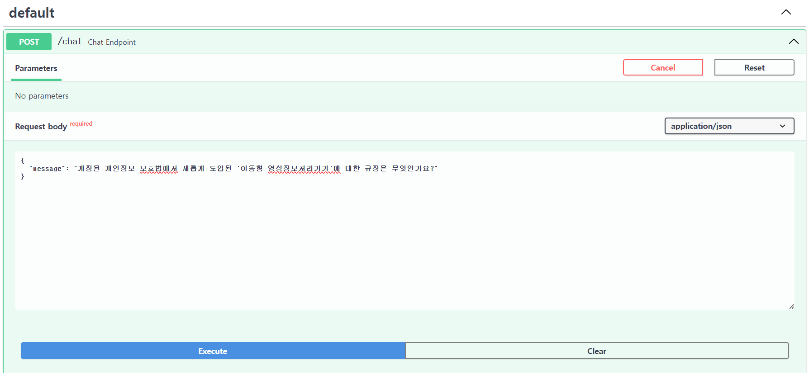
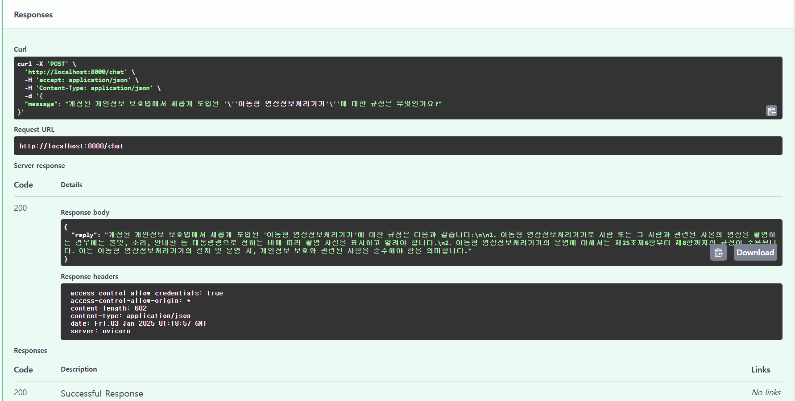

# ✒️ 법톡스

## 서비스 개요
스타트없과 중소기업을 대상으로 한 개인정보 보호법 준수 지원 chatbot 형식의 서비스입니다. 개인정보를 활용할 상황에 대한 정보를 입력하면, 개인 정보 보호법 위반 리스크를 분석하고, 적절한 해결 방안을 제시합니다. 


## 사용법

동영상


## 배포 링크

- BackEnd 링크

  - [https://ssafy-2024-backend-aged-dew-5322.fly.dev/](https://ssafy-2024-backend-aged-dew-5322.fly.dev/)

- FrontEnd 링크

  - []()


## 로컬 실행 방법

### BackEnd

1. requirements.txt를 통해 필요한 라이브러리 설치

    ```bash
    $ pip install -r requirements.txt
    ```

2. 환경변수(.env)로 api key 설정 후 app.py 실행

    ```bash
    $ python app.py
    ```

3. 백엔드 서버가 켜지고 [https://localhost:8000/docs](https://localhost:8000/docs)의 /chat endpoint에서 테스트

  - 질문

    

  - 응답

    


### FrontEnd
